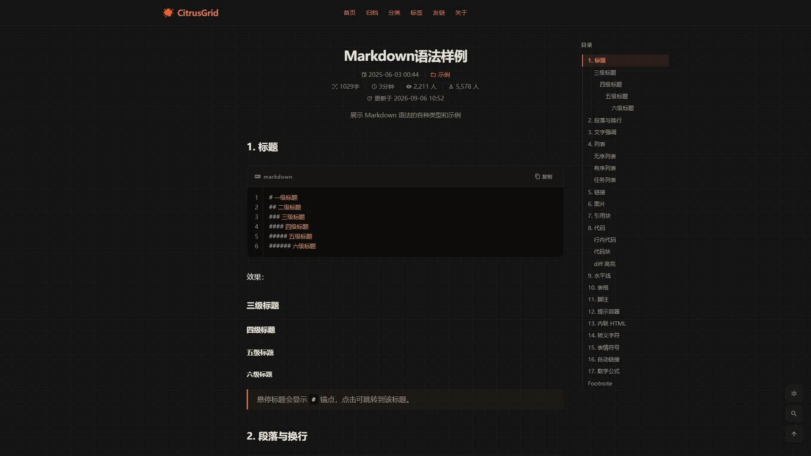
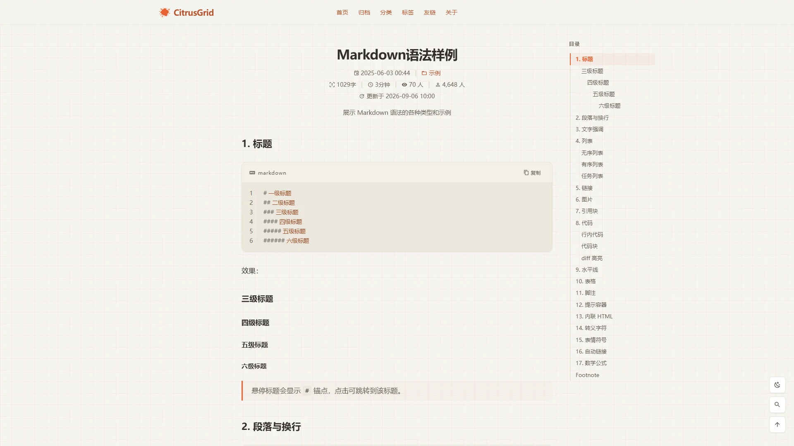

<div align="center">
  
  <h1 align="center">CitrusGrid 柑橘格子</h1>
  <p>基于 Astro 的轻量级静态博客主题，以<strong>柑橘色（#E86233）</strong>为主色调，方格草稿纸为背景样式，带来轻量级的 markdown 博客需求。</p>
  
  
  
  <br>
  <a href="https://citrusgrid.pages.dev">Demo</a> | <a href="./docs/README.en.md">English</a> | <a href="./docs/README.ja.md">日本語</a>
</div>

---

<table width="100%" align="center" cellpadding="8" cellspacing="0">
  <tr>
    <th colspan="2" align="center">暗夜模式</th>
  </tr>
  <tr>
    <td align="center"><br>暗夜模式</td>
    <td align="center"><br>白天模式</td>
  </tr>

  <tr>
    <td align="center"><br>暗夜模式文章</td>
    <td align="center"><br>白天模式文章</td>
  </tr>

  <tr>
    <th colspan="2" align="center">PageSpeed Insights 性能测试</th>
  </tr>
  <tr>
    <td align="center"><br>桌面端性能</td>
    <td align="center"><br>手机性能</td>
  </tr>
</table>

---

## 快速开始

1、克隆本项目(记得给本项目点个Star👍)

```bash
git clone https://github.com/rightdoor/citrus-grid.git
```

2、安装依赖及运行

```bash
pnpm install
pnpm dev
pnpm build
pnpm preview
```

## 命令说明

| 命令 | 作用 |
| --- | --- |
| `pnpm dev` / `start` | 启动开发服务器 |
| `pnpm build` | 生产构建，随后自动注入 `modulepreload`、压缩内联脚本，并执行 `pagefind` 生成站内搜索索引 |
| `pnpm preview` | 预览 `dist` 构建产物 |
| `pnpm check` | Astro 类型检查（`astro check`） |
| `pnpm type-check` | TypeScript 类型检查（`tsc --noEmit`，覆盖 `src` 与 `scripts`） |
| `pnpm new-post [slug]` | 新建文章模板（见下方说明） |
| `pnpm format-post-meta` | 统一重排所有文章 frontmatter 字段顺序 |
| `pnpm format` | Biome 格式化 `src` |
| `pnpm format:all` | Biome 检查并修复全项目代码（src、scripts、根目录配置文件） |
| `pnpm lint` | Biome 检查并修复 `src` |
| `preinstall` | 自动执行 `only-allow pnpm`，强制使用 pnpm |

## 配置

详细内容请查看配置文件 [config.yaml](src/config.yaml)，预设配置请参考 `src/lib/siteConfig.ts`。

## 文章 Frontmatter

| 字段 | 是否必填 | 示例 | 描述 |
| --- | --- | --- | --- |
| `title` | 是 | "example" | 文章标题 |
| `slug` | 是 | example | 运行时自动生成，可手动填写，使用`-`分隔单词 |
| `index` | 是 | 0 | 默认为0不置顶，大于0的整数置顶，数值越大越靠前 |
| `description` | 是 | "展示 Markdown 语法的各种类型和示例" | 文章描述 |
| `category` | 是 | "示例" | 文章分类 |
| `tags` | 是 | [Markdown] | 文章标签，多个标签用逗号隔开 |
| `published` | 是 | 2026-01-01 00:01:02 | 文章发布时间，格式为`YYYY-MM-DD HH:mm:ss`，脚本生成自带 |
| `updated` | 否 | 2026-01-01 00:01:03 | 文章更新时间，格式为`YYYY-MM-DD HH:mm:ss`，不自动生成 |
| `draft` | 否 | false | 是否草稿，不自动生成 |

## 功能

- [x] i18n 支持（zh、en、ja三语）
- [x] 支持 GFM 语法
- [x] 支持 KaTeX 数学公式
- [x] 明暗主题切换
- [x] 搜索功能（pagefind）
- [x] 评论功能（当前只支持 utterances 评论）
- [x] 目录功能（桌面端侧边固定 + 移动端弹窗）
- [x] RSS 订阅功能
- [x] 友链功能
- [x] 代码高亮（Prism 构建期高亮，客户端零 JS）与代码复制按钮
- [x] 图片灯箱（PhotoSwipe）与 LQIP 渐变占位骨架
- [x] 阅读统计（已预留接口）

## 插件

### 统计插件

支持全局和文章PV/UV统计，已预留接口。

当前自带统计插件有 `visitor-stats.ts`，项目地址为 [visitor-stats](https://github.com/rightdoor/visitor-stats)。需要在cloudflare worker中自行部署统计服务。

支持自定义统计插件，详细参考 [统计插件](src/stats/使用规则.md)。

## License

本项目使用 [MIT License](LICENSE.txt) 开源。详细条款请参阅项目根目录下的 `LICENSE.txt` 文件。
