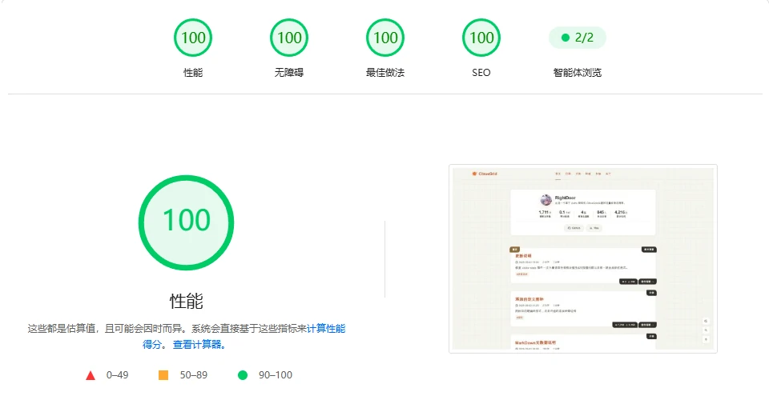

<div align="center">
  
  <h1 align="center">CitrusGrid 柑橘格子</h1>
  <p>A lightweight static blog theme based on Astro, with <strong>tangerine (#E86233)</strong> as the primary color and a grid paper background, fulfilling lightweight Markdown blog needs.</p>
  
  
  
  <br>
  <a href="https://citrusgrid.pages.dev">Demo</a> | <a href="../README.md">中文</a> | <a href="./README.ja.md">日本語</a>
</div>

---

<table width="100%" align="center" cellpadding="8" cellspacing="0">
  <tr>
    <th colspan="2" align="center">Dark Mode</th>
  </tr>
  <tr>
    <td align="center"><br>Dark Mode</td>
    <td align="center"><br>Light Mode</td>
  </tr>

  <tr>
    <th colspan="2" align="center">PageSpeed Insights Performance Test</th>
  </tr>
  <tr>
    <td align="center"><br>Desktop Performance</td>
    <td align="center"><br>Mobile Performance</td>
  </tr>
</table>

---

## Quick Start

1. Clone this repository (don't forget to give it a Star 👍)

```bash
git clone https://github.com/rightdoor/citrus-grid.git
```

2. Install dependencies and run

```bash
pnpm install
pnpm dev
pnpm build
pnpm preview
```

## Commands

| Command | Description |
| --- | --- |
| `pnpm dev` / `start` | Start the development server |
| `pnpm build` | Production build, then automatically inject `modulepreload`, compress inline scripts, and run `pagefind` to generate the search index |
| `pnpm preview` | Preview the `dist` build output |
| `pnpm check` | Astro type checking (`astro check`) |
| `pnpm type-check` | TypeScript type checking (`tsc --noEmit`, covers `src` and `scripts`) |
| `pnpm new-post [slug]` | Create a new post template (see below) |
| `pnpm format-post-meta` | Unify and reorder frontmatter fields of all posts |
| `pnpm format` | Biome formatting for `src` |
| `pnpm format:all` | Biome check and fix the entire project (src, scripts, root config files) |
| `pnpm lint` | Biome check and fix `src` |
| `preinstall` | Automatically runs `only-allow pnpm` to enforce using pnpm |

## Configuration

For detailed settings, please refer to the config file [config.yaml](src/config.yaml). Preset configurations are available in `src/lib/siteConfig.ts`.

## Post Frontmatter

| Field | Required | Example | Description |
| --- | --- | --- | --- |
| `title` | Yes | "example" | Post title |
| `slug` | Yes | example | Automatically generated at runtime; can be manually set, using `-` to separate words |
| `index` | Yes | 0 | Default 0 (not pinned); positive integers pin the post, larger numbers appear higher |
| `description` | Yes | "Demonstrates various Markdown syntax types and examples" | Post description |
| `category` | Yes | "Example" | Post category |
| `tags` | Yes | [Markdown] | Post tags, multiple tags separated by commas |
| `published` | Yes | 2026-01-01 00:01:02 | Publication time, format `YYYY-MM-DD HH:mm:ss`; auto-generated by script |
| `updated` | No | 2026-01-01 00:01:03 | Update time, format `YYYY-MM-DD HH:mm:ss`; not auto-generated |
| `draft` | No | false | Whether it is a draft; not auto-generated |

## Features

- [x] GFM syntax support
- [x] KaTeX math formula support
- [x] Light/Dark theme toggle
- [x] Search functionality (pagefind)
- [x] Comments (currently only utterances)
- [x] Table of contents (fixed sidebar on desktop + modal on mobile)
- [x] RSS subscription
- [x] Friends link feature
- [x] Code highlighting (Prism built‑time highlighting, zero client‑side JS) with copy button
- [x] Image lightbox (PhotoSwipe) with LQIP gradient placeholder skeleton
- [x] Reading statistics (API reserved)

## Plugins

### Statistics Plugin

Supports global and per‑post PV/UV statistics, with reserved API.

The bundled statistics plugin is `visitor-stats.ts` (project: [visitor-stats](https://github.com/rightdoor/visitor-stats)). You need to deploy the statistics service on Cloudflare Worker yourself.

Custom statistics plugins are also supported; please refer to [Statistics Plugin](src/stats/使用规则.md) for details.

## License

This project is open-sourced under the [MIT License](LICENSE.txt). For detailed terms, please refer to the `LICENSE.txt` file in the project root directory.
